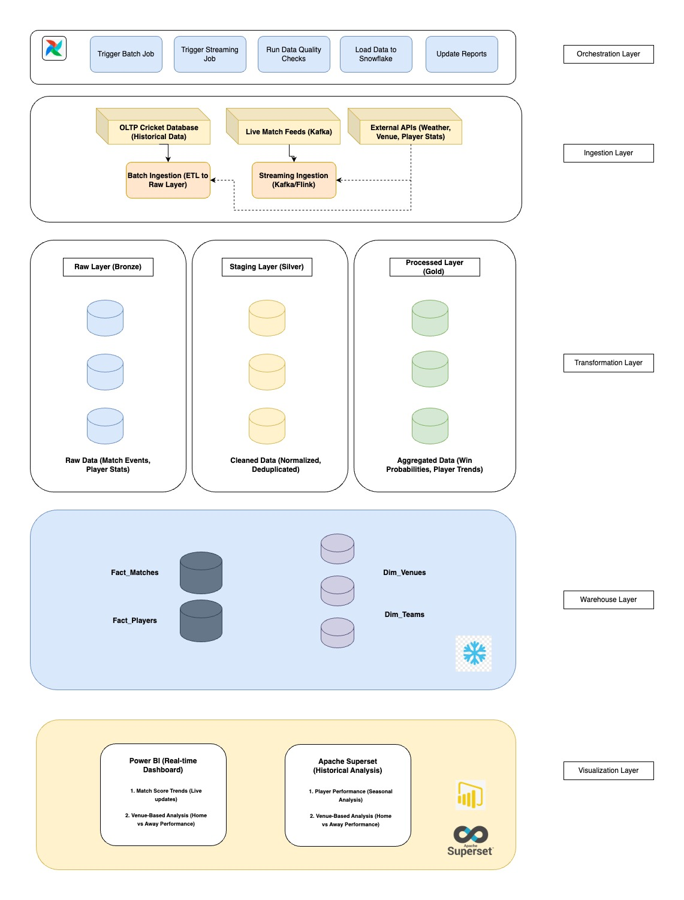

# Cricket Analytics Pipeline 🏏📊

## 🚀 Overview
The **Cricket Analytics Pipeline** is an end-to-end **data engineering project** designed to **ingest, process, and analyze** cricket match data in **real-time**. This project integrates **batch and streaming data processing**, follows a **medallion architecture**, and leverages **Snowflake** for data storage. Dashboards in **Power BI** and **Apache Superset** provide real-time insights.

## 📌 Architecture


## 🏗️ Project Structure
```
cricket-analytics-pipeline/
│── README.md                  # Project overview and setup guide
│── docs/                       # Documentation, diagrams, and architecture details
│── ingestion/                   # Batch & Streaming ingestion scripts
│── transformation/               # Data processing & transformation scripts
│── warehouse/                    # Data warehouse setup scripts (Snowflake)
│── dashboards/                    # Power BI or Superset dashboard files
│── orchestration/                  # Airflow DAGs for scheduling
│── config/                         # Config files for credentials, environment variables
│── .gitignore                      # Ignoring unnecessary files (logs, credentials)
│── requirements.txt                 # Python dependencies
│── setup.py                         # Optional if you package the project
```

## 🔧 Technologies Used
- **Batch Processing:** Python, SQL
- **Streaming Processing:** Kafka, Flink
- **Orchestration:** Apache Airflow
- **Storage:** Snowflake
- **Visualization:** Power BI, Apache Superset